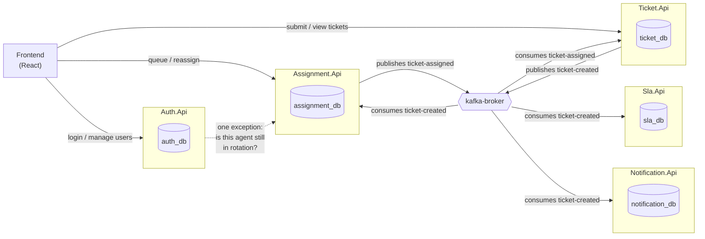

# IT Helpdesk Platform

A microservices-based IT support ticket system — employees raise tickets,
they're automatically routed to agents in a fair rotation, agents work
their queue and resolve them, and admins manage the people and the process
end to end. Built as a set of independent, event-driven .NET services with
a React frontend, deployed to Azure Container Apps.

---

## Table of contents

- [What this is](#what-this-is)
- [Tech stack](#tech-stack)
- [Architecture](#architecture)
- [Repository layout](#repository-layout)
- [Getting it running locally](#getting-it-running-locally)
- [Roles, in one table](#roles-in-one-table)
- [Local URLs, all in one place](#local-urls-all-in-one-place)
- [Running the tests](#running-the-tests)
- [Further documentation](#further-documentation)
- [Known limitations](#known-limitations)

---

## What this is

Three roles, one workflow:

- **Employee** — submits a ticket (description, issue type, urgency), can
  see the status and full history of everything they've raised.
- **Agent** — gets tickets automatically assigned to them in round-robin
  order, works through their queue sorted by urgency, marks tickets In
  Progress / Resolved / Closed.
- **Administrator** — manages every account (create, edit, deactivate),
  manages who's in the agent rotation, can view and manually reassign any
  ticket, and sees the full picture across the whole system.

The interesting part isn't any single screen — it's that tickets flow
through the system on their own once submitted: creation triggers an
event, a separate service picks it up and assigns it, a third piece keeps
the ticket's own record in sync with who has it, all without the pieces
calling each other directly.

---

## Tech stack

| Layer | Technology |
|---|---|
| Backend | 5 independent **.NET 8** Web API services (ASP.NET Core) |
| ORM | **Entity Framework Core** + Pomelo's MySQL provider |
| Database | **MySQL 8** — one schema per service, no shared database |
| Messaging | **Apache Kafka** (KRaft mode — no ZooKeeper) |
| Auth | **JWT bearer tokens**, validated independently by every service |
| Frontend | **React** (Create React App), React Router, plain `fetch` — no state library |
| Local orchestration | **Docker Compose** (MySQL + Kafka + Kafka UI) |
| CI/CD | **GitHub Actions** — one path-filtered workflow per service |
| Container registry | **Azure Container Registry** |
| Hosting | **Azure Container Apps** (serverless containers, scale-to-zero) |

---

## Architecture

Five services, each with its own database, talking to each other almost
entirely through Kafka events rather than direct calls to one another:



**The one deliberate exception** to "services never call each other
directly": Auth.Api makes a single synchronous HTTP call to Assignment.Api
before letting an admin deactivate or re-role an active agent, to check
whether they're still holding live tickets. Fail-closed — if that call
can't be reached, the action is blocked, not silently allowed.

Every service validates JWTs completely on its own (same signing
key/issuer/audience everywhere) — there's no central gateway or auth
service round-trip on every request.

---

## Repository layout

```
services/
  auth/Auth.Api            # accounts, login, JWT issuance
  ticket/Ticket.Api         # ticket CRUD, status lifecycle + history
  assignment/Assignment.Api # round-robin rotation, agent queue, reassignment
  notification/Notification.Api
  sla/Sla.Api
frontend/                   # React app (Create React App)
docker-compose.yml           # local MySQL + Kafka + Kafka UI
docs/                        # CI/CD, deployment, and troubleshooting guides
```

Every backend service follows the same internal shape:
`Model/ → Data/ → Migrations/ → DTO/ → Services/ → Controller/ →
Authorization/ → Program.cs`. Learn one, you've learned the layout of all
five.

---

## Getting it running locally

### Prerequisites

- [.NET 8 SDK](https://dotnet.microsoft.com/download/dotnet/8.0)
- [Node.js 20+](https://nodejs.org/)
- [Docker Desktop](https://www.docker.com/products/docker-desktop/)
- (optional) a MySQL client, if you want to inspect data directly

### 1. Start the shared infrastructure

```
docker compose up -d
```

This brings up local MySQL (port **3307**, not the default 3306, so it
won't clash with anything else you have running) and Kafka (port
**9092**), plus a Kafka UI dashboard at **http://localhost:8081** for
browsing topics and messages while you develop.

### 2. Run each backend service

Each one needs its own terminal:

```
cd services/auth/Auth.Api          && dotnet run
cd services/ticket/Ticket.Api       && dotnet run
cd services/assignment/Assignment.Api && dotnet run
cd services/notification/Notification.Api && dotnet run
cd services/sla/Sla.Api             && dotnet run
```

`dotnet run` uses each project's own `launchSettings.json`, so no
`--urls` flag needed — see [Local URLs](#local-urls-all-in-one-place)
below for exactly which port each one lands on.

### 3. Run the frontend

```
cd frontend
npm install
npm start
```

Opens at **http://localhost:3000**, already pointed at the local backend
ports via `.env.development`.

### 4. Create your first account

The public `/api/auth/register` endpoint always creates an **Employee**
account through the frontend's sign-up form — there's no self-service way
to become an Agent or Administrator, and creating those roles normally
requires an *existing* Administrator (a chicken-and-egg problem on a brand
new database).

To bootstrap your very first admin account, register directly against the
API instead of the frontend, passing a role explicitly:

```
curl -X POST http://localhost:5121/api/auth/register \
  -H "Content-Type: application/json" \
  -d "{\"name\":\"Admin\",\"email\":\"admin@local.test\",\"password\":\"Passw0rd!\",\"role\":3}"
```

(`role`: `1` = Employee, `2` = Agent, `3` = Administrator.) Log in with
that account, and use the admin **Create user** page for every account
after this one — this manual step is only needed once, for the first
admin on a fresh database.

> **Note:** the fact this works at all is a real gap, not a documented
> feature — `/register` doesn't currently restrict which role a caller can
> request. See [Known limitations](#known-limitations).

### 5. Add an agent to the rotation

A fresh `assignment_db` comes with two **placeholder** agent entries
seeded by migration (`UserId` 3 and 26) — these were a local-dev stand-in
from early development and don't correspond to real accounts. Create a
real Agent-role account (via the admin **Create user** page), note its
numeric ID, then add it via **Agent rotation → Add to rotation**. There's
currently no UI to remove the old placeholders — do that directly in
`assignment_db.Agents` if it bothers you locally.

---

## Roles, in one table

| Role | Can do |
|---|---|
| Employee | Submit tickets, view their own ticket history |
| Agent | View their queue (urgency-sorted), mark tickets In Progress / Resolved / Closed |
| Administrator | Everything Agent can view, plus: manage all accounts, manage the agent rotation, view every ticket, manually reassign any ticket |

---

## Local URLs, all in one place

| Thing | URL |
|---|---|
| Frontend | http://localhost:3000 |
| Auth.Api | http://localhost:5121 |
| Ticket.Api | http://localhost:5164 |
| Assignment.Api | http://localhost:5067 |
| Notification.Api | http://localhost:5214 |
| Sla.Api | http://localhost:5262 |
| MySQL | `localhost:3307` (root / `localdevpassword`) |
| Kafka | `localhost:9092` |
| Kafka UI | http://localhost:8081 |

---

## Running the tests

Each backend service has its own test project (EF Core InMemory for
service-level logic, real MySQL via `WebApplicationFactory` for
controller/authorization tests — the local MySQL from step 1 needs to be
running):

```
dotnet test services/auth/Auth.Api.Tests
dotnet test services/ticket/Ticket.Api.Tests
dotnet test services/assignment/Assignment.Api.Tests
```

---

## Further documentation

- [`docs/CI-CD-PIPELINE-EXPLAINED.md`](docs/CI-CD-PIPELINE-EXPLAINED.md) — how the GitHub Actions pipelines, Dockerfiles, and Azure infrastructure fit together.
- [`docs/PRODUCTION_DEPLOYMENT_GUIDE.md`](docs/PRODUCTION_DEPLOYMENT_GUIDE.md) — the manual steps CI/CD doesn't cover (migrations, ingress/CORS, secrets, seed data) — read this before shipping anything beyond plain app logic.
- [`docs/DEPLOY_KAFKA_UI.md`](docs/DEPLOY_KAFKA_UI.md) — how the production Kafka UI dashboard was set up.
- [`docs/LOCAL_DEV_TROUBLESHOOTING.md`](docs/LOCAL_DEV_TROUBLESHOOTING.md) — common local setup issues and fixes.

---

## Known limitations

- **`POST /api/auth/register` doesn't restrict the requested role.** The
  frontend only ever sends Employee, but nothing server-side stops a
  direct API call from requesting Administrator. Worth fixing before this
  goes anywhere more exposed than a local/academic deployment.
- **No automated tests run in CI** — only `dotnet build`/`npm run build`.
  A broken test doesn't block a deploy.
- **No migration step in CI/CD** — a migration merged into the repo has
  no effect on the live database until someone applies it by hand. See
  `PRODUCTION_DEPLOYMENT_GUIDE.md` section 3a.
- **No "remove agent from rotation" UI** — only adding is supported;
  removing requires a direct database edit.
- **No bulk reassignment** — tickets can only be reassigned one at a time.
