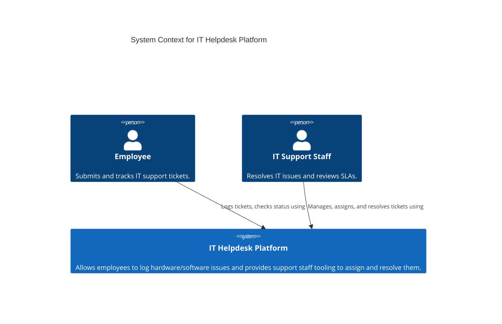
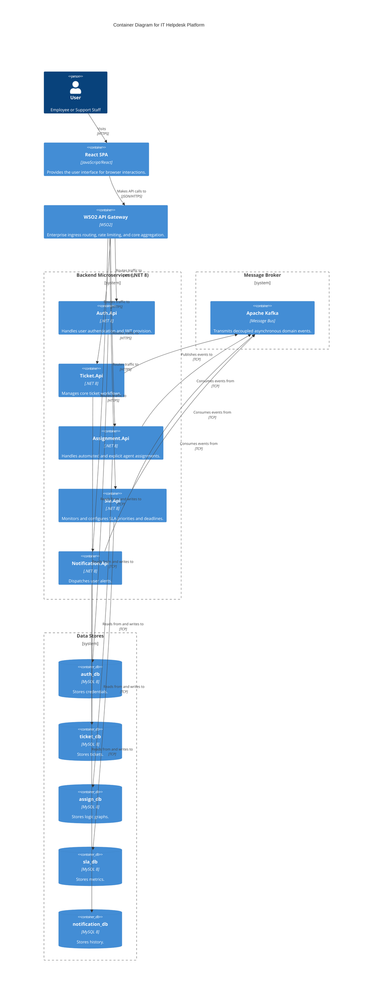

# C4 Architecture Diagrams

## 1. System Context Diagram
This diagram outlines how staff and employees interact with the overarching Helpdesk Platform.



## 2. Container Diagram
Detailed breakdown of the Microservice topology backing the Helpdesk.



## 3. Deployment Diagram (Azure Target)
Depicts how the containers map out into the finalized Azure Cloud physical spaces.

```mermaid
C4Deployment
    title Deployment Diagram - Azure Target (Production)
    
    Deployment_Node(cloud, "Microsoft Azure", "Azure Cloud Platform") {
        Deployment_Node(vnet, "Azure Virtual Network", "Secured internal boundary") {
            
            Deployment_Node(aca, "Azure Container Apps", "Serverless orchestration") {
                Container(apiWso2, "WSO2 API Gateway Container", "Docker")
                Container(authApp, "Auth.Api Runtime", ".NET 8 Docker")
                Container(ticketApp, "Ticket.Api Runtime", ".NET 8 Docker")
                Container(assignApp, "Assignment.Api Runtime", ".NET 8 Docker")
                Container(slaApp, "Sla.Api Runtime", ".NET 8 Docker")
                Container(notifyApp, "Notification.Api Runtime", ".NET 8 Docker")
            }
            
            Deployment_Node(azSql, "Azure Database for MySQL flexible server", "Managed PAAS DB") {
                ContainerDb(allDbs, "MySQL 8 Schema instances", "MySQL", "Hosts all decoupled schemas.")
            }
            
            Deployment_Node(kv, "Azure Key Vault", "Secrets Engine") {
                 Container(secrets, "App Secrets", "Tokens / Configs")
            }
        }
    }
    
    Deployment_Node(confluent, "Confluent Cloud / Azure Event Hubs", "Managed Kafka") {
         Container(kafkaProd, "Production Topics", "Kafka")
    }
    
    Rel(apiWso2, authApp, "Routes to")
    Rel(ticketApp, kafkaProd, "Publishes to")
    Rel(slaApp, kafkaProd, "Subscribes to")
    Rel(authApp, allDbs, "Reads/Writes")
    Rel(ticketApp, kv, "Retrieves credentials from")
    
```
